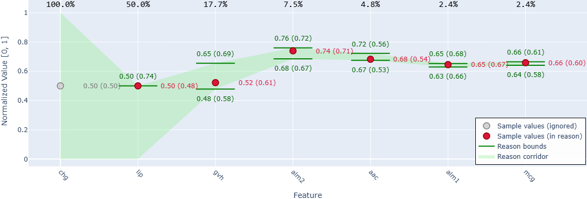
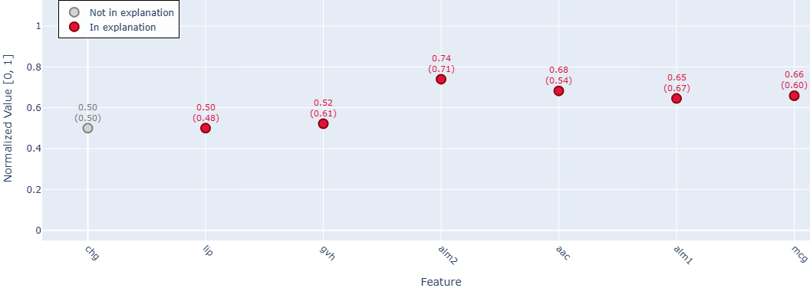
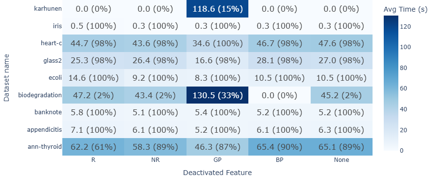
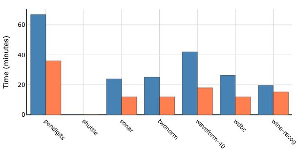
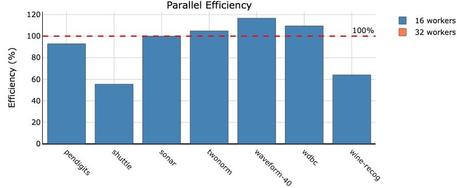
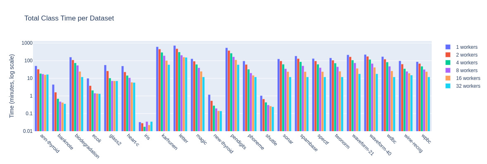
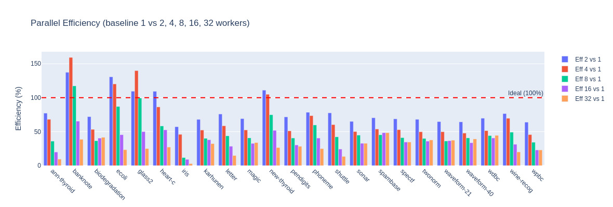

# RF-MaximalContinuousReason

This repo provides the info for the paper **Maximal Continuous Reason for Random Forest Classification**.

## Table of Contents

- [Abstract](#abstract)
- [Maximal Continuous Reason Examples](#maximal-continuous-reason-examples)
- [Results Preview](#results-preview)
  - [Ablation Results](#ablation-results)
  - [Scalability Results](#scalability-results)
- [Installation](#installation)
  - [Option 1: Docker (Recommended)](#option-1-docker-recommended)
  - [Option 2: Local Installation](#option-2-local-installation)
- [Usage](#usage)
  - [UCI Dataset Initialisation](#uci-dataset-initialisation)
  - [OpenML Datasets](#openml-datasets)
  - [PMLB Datasets](#pmlb-datasets)
  - [AXp inizialization](#axp-inizialization)
- [Quick Start Tutorial](#quick-start-tutorial)
- [Running the Experiments](#running-experiments)
  - [1. Worker Scaling Experiments](#1-worker-scaling-experiments)
  - [2. Ablation Study](#2-ablation-study)
  - [3. AXp Experiments](#3-axp-experiments)
  - [Monitoring Experiments](#monitoring-experiments)
- [Analysis and Visualization](#analysis-and-visualization)

## Abstract

As complex machine learning models are increasingly deployed in critical systems, ensuring their transparency and trustworthiness is paramount. Explainability methods that provide formal guarantees about model behavior are essential for accountability and robust verification. This paper investigates the problem of generating formal explanations for classifiers in tabular domain. Our main objective is to introduce the concept of a maximal continuous reason. We formalize this concept as an Interval Constraint Function (ICF) which, given a classifier and a sample, assigns an interval that wraps each feature value of the sample. An ICF that is a reason for the sample guarantees that all data points falling within these feature intervals are assigned the same class label. A maximal continuous reason  means that any interval in ICF could not be extended without necessarily include samples that receive a different class label, therefore such a property is paramount for precisely characterizing the decision boundaries of the classifier on a sample-wise basis. We prove that verifying a continuous reason is coNP-complete via a reduction from Max2SAT, hence computing the maximal continuous reason turns out to be $D^P$. Given this computational complexity we then develop a distributed algorithm that leverages an in-memory key-value store to coordinate multiple workers.
The effectiveness and scalability of our approach are validated empirically on Random Forest models using tabular dataset.

This repository contains utilities, code and results for converting scikit-learn tree ensembles
into the internal MCR representation and for preparing tabular datasets. The tooling spans
from dataset initialisation scripts to helpers that persist forests and samples
into Redis-backed caches.

## Maximal continuous reason examples

Maximal continuous reason vs [AXp](https://arxiv.org/abs/2105.10278)

### Tabular dataset

**Maximal Continuous Reason:**



**AXp Explanation:**



## Results Preview

The experimental results are summarized in the following visualizations.

**Coverage Comparison: AXp vs MCR**

| Dataset        | AXp Coverage (%) | Our Coverage (%) |
| -------------- | ---------------- | ---------------- |
| ann-thyroid    | **86.54**  | 51.33            |
| appendicitis   | **42.52**  | 40.20            |
| banknote       | 29.71            | **43.29**  |
| biodegradation | **45.82**  | 39.77            |
| ecoli          | 21.72            | **36.13**  |
| glass2         | 24.75            | **30.45**  |
| heart-c        | 33.17            | **49.12**  |
| ionosphere     | 17.97            | **48.48**  |
| iris           | 13.75            | **45.51**  |
| karhunen       | 3.51             | **35.75**  |
| letter         | 1.38             | **44.21**  |
| magic          | 23.75            | **32.59**  |
| mofn-3-7-10    | 67.82            | **83.20**  |
| new-thyroid    | 29.30            | **42.97**  |
| pendigits      | 2.81             | **33.34**  |
| phoneme        | 31.50            | **36.36**  |
| ring           | 39.57            | **41.10**  |
| shuttle        | **61.28**  | 55.08            |
| sonar          | 18.97            | **42.63**  |
| spambase       | 21.72            | **38.01**  |
| spectf         | 49.92            | **50.03**  |
| texture        | 4.40             | **33.94**  |
| threeOf9       | 50.12            | **72.74**  |
| twonorm        | 23.80            | **44.28**  |
| vowel          | 4.35             | **20.23**  |
| waveform-21    | 22.59            | **35.41**  |
| waveform-40    | 16.02            | **36.18**  |
| wdbc           | 41.23            | **46.95**  |
| wine-recog     | 18.70            | **58.20**  |
| wpbc           | **38.38**  | 35.77            |

### Ablation results

The ablation analysis reveals heterogeneous effects of disabling the GP check across datasets, as shown in the figure below.
For instance, on *karhunen*, disabling GP leads to a higher percentage of successfully processed samples (15% versus 0%), which might suggest that GP is unnecessary in this case.
However, this behavior does not generalize: on datasets such as *ann-thyroid*, disabling GP leads to a substantially higher number of timeouts, which indicates that, although the GP check is computationally expensive, it prevents a large number of reason-check iterations.
Interestingly, on *biodegradation* performance also improves when GP is disabled, suggesting that datasets with a large number of features may benefit more from disabling GP. Overall, in this preliminary analysis, the remaining early-stopping mechanisms appear to have a limited impact on performance, whereas GP shows the most pronounced effect.

The data are also computated and available in `ablation.ipynb`.



## Scalability results

The scalability analysis indicates that employing 32 workers consistently yields faster execution times than using 16 workers, as illustrated in the figure below. These results were obtained using configurations with 16 and 32 workers as a preliminary scalability assessment, given that the proposed algorithm is designed to operate in highly distributed environments. In such settings, information shared among workers, specifically in the form of reasons and profiles, can effectively accelerate the execution of other workers.
This effect is particularly pronounced for datasets with a large number of features, where the observed efficiency exceeds 100% when the number of processors is doubled. Such speedups arise because increased parallelism promotes earlier communication and reuse of shared information.
Conversely, for smaller datasets, such as *shuttle* and *wine-recognition*, the communication overhead introduced by additional workers is not sufficiently compensated by the corresponding reduction in the exploration space. As a result, increasing the number of workers in these cases yields less parallel efficiency.

The data are also computated and available in `coverage.ipynb`.




**Scalability Data: 16 vs 32 Workers**

| Dataset     | Time 16 Workers (s) | Time 32 Workers (s) | Speedup | Total Speedup | Efficiency |
| ----------- | ------------------- | ------------------- | ------- | ------------- | ---------- |
| pendigits   | 4013.83             | 2160.00             | 1.86    | 1.86          | 0.93       |
| shuttle     | 16.12               | 14.52               | 1.02    | 1.11          | 0.55       |
| sonar       | 1440.00             | 720.00              | 2.00    | 2.00          | 1.00       |
| twonorm     | 1510.91             | 720.00              | 2.10    | 2.10          | 1.05       |
| waveform-40 | 2520.00             | 1080.00             | 2.33    | 2.33          | 1.17       |
| wdbc        | 1577.21             | 720.00              | 2.19    | 2.19          | 1.10       |
| wine-recog  | 1176.55             | 917.45              | 1.25    | 1.28          | 0.64       |

**Scalability Data: 32, 16, 8, 4, 2, 1 Workers**




## Installation

### Option 1: Docker (Recommended)

Docker provides an isolated environment with Redis pre-configured.

**Requirements:**

- Docker Desktop installed and running
  - Windows: https://www.docker.com/products/docker-desktop
  - Linux/macOS: https://docs.docker.com/get-docker/

**Quick Start:**

```bash
# Windows
./run.bat

# Linux/macOS
chmod +x run.sh  # First time only
./run.sh
```

This will build the Docker image and start a container with Redis on `localhost:6379` and run the code within jupyter on `localhost:8888`.

**Available Commands:**

| Command | Windows                          | Linux/macOS                        | Description                  |
| ------- | -------------------------------- | ---------------------------------- | ---------------------------- |
| Start   | `run.bat` or `run.bat start` | `./run.sh` or `./run.sh start` | Build and start container    |
| Stop    | `run.bat stop`                 | `./run.sh stop`                  | Stop container               |
| Shell   | `run.bat shell`                | `./run.sh shell`                 | Open bash shell in container |
| Logs    | `run.bat logs`                 | `./run.sh logs`                  | View container logs          |
| Restart | `run.bat restart`              | `./run.sh restart`               | Restart container            |
| Help    | `run.bat help`                 | `./run.sh help`                  | Show help                    |

**Using the container:**

```bash
# Open shell in container
./run.bat shell  # Windows
./run.sh shell # Linux/macOS

# Inside the container, run any script:
python init_uci.py Iris --class-label "Iris-setosa" --optimize
python launch_workers.py start
```

The following directories are automatically mounted and accessible from your host:

- `./logs` - Application logs
- `./workers` - Workers configuration
- `./results` - Experiment results

### Option 2: Local Installation

1. **Create a virtual environment (recommended)**

   ```bash
   python -m venv .venv
   source .venv/bin/activate
   ```
2. **Install the Python dependencies**

   ```bash
   pip install --upgrade pip
   pip install -r requirements.txt
   ```

   The `requirements.txt` file includes all necessary dependencies.
3. **Start Redis**

   ```bash
   redis-server
   ```

   More info at https://redis.io/learn/howtos/quick-start

## Usage

### UCI dataset initialisation

`init_uci.py` provides the same functionality for tabular classification datasets from the [UCI Machine Learning Repository](https://archive.ics.uci.edu/). Examples:

```bash
# List supported datasets
python init_uci.py --list-datasets

# Show dataset information
python init_uci.py Iris --info

# Optimise a Random Forest for the Iris dataset using Bayesian search
python init_uci.py Iris --class-label "Iris-setosa" --optimize

# Use a dataset by UCI ID instead of name
python init_uci.py --id 53 --class-label "Iris-setosa"

# Use a specific set of test samples 
python init_uci.py Wine --class-label "1" --test-sample-index "0-2, 5, 10-12"
```

#### Core arguments

- `dataset_name` — Dataset to load (or use `--id` for UCI ID)
- `--class-label` — Class label whose samples will be processed
- `--list-datasets` — Print the curated catalogue of supported UCI datasets and exit.
- `--info` — Display dataset metadata without performing any processing.
- `--test-split` *(float, default: 0.3)* — Fraction of data to use for testing.
- `--redis-port` *(int, default: 6379)* — Port of the Redis or KeyDB instance.

#### Bayesian optimisation controls

- `--optimize` — Enable Bayesian optimisation via `scikit-optimize` to tune the Random Forest hyper-parameters.

Run `python init_uci.py --help` to view the auto-generated help message with the latest defaults.

### OpenML Datasets

Initialize the system with any classification dataset from [OpenML](https://www.openml.org/).
Uses the dataset **Name** for selection (automatically picks the latest active version).

```bash
# List popular/active OpenML datasets
python init_openml.py --list-datasets

# Initialize with 'Iris' (Name-based resolution)
python init_openml.py iris --class-label "Iris-setosa" --n-estimators 10

# Initialize with 'mnist_784' (Example)
python init_openml.py mnist_784 --class-label "0" --n-estimators 50

# Use a specific set of test samples 
python init_openml.py credit-g --class-label "good" --test-sample-index "0-2, 5, 10-12"
```

### PMLB Datasets

Initialize the system with any dataset from [PMLB](https://github.com/EpistasisLab/pmlb).
Uses the dataset **Name** for selection.

```bash
# List available PMLB classification datasets
python init_pmlb.py --list-datasets

# Initialize with 'glin_1' (or other PMLB name)
python init_pmlb.py glin_1 --class-label "0" --n-estimators 10

# Initialize with 'iris' (PMLB version)
python init_pmlb.py iris --class-label "0" --n-estimators 10

# Use a specific set of test samples 
python init_pmlb.py sonar --class-label "1" --test-sample-index "0-2, 5, 10-12"
```

### Axp inizialization

Initialize the system with pre-trained Random Forest classifiers and corresponding datasets from the baseline directory. This is useful for reproducing experiments with specific classifier configurations.

```bash
# List available baseline datasets with pre-trained classifiers
python init_baseline.py --list-datasets

# Initialize with a baseline dataset (uses pre-trained RF from baseline/Classifiers-100-converted/)
python init_baseline.py iris --class-label "0"

# Initialize with specific dataset
python init_baseline.py sonar --class-label "1"

# Example with other baseline datasets
python init_baseline.py banknote --class-label "0"
python init_baseline.py ecoli --class-label "1"
```

#### Core arguments

- `dataset_name` — Dataset to load from baseline directory
- `--class-label` — Class label whose samples will be processed
- `--list-datasets` — Print available baseline datasets with pre-trained classifiers
- `--redis-port` *(int, default: 6379)* — Port of the Redis or KeyDB instance

#### Features

- Loads pre-trained Random Forest classifiers from `baseline/Classifiers-100-converted/`
- Loads corresponding datasets from `baseline/resources/datasets/`
- Uses pre-defined train/test splits for reproducibility
- Automatically detects classifier parameters (n_estimators, max_depth) from filenames
- Validates dataset and classifier compatibility

Run `python init_baseline.py --help` to view the auto-generated help message with the latest defaults.

---

## Quick Start Tutorial

> **Note:** If using Docker, run `run.bat shell` (Windows) or `./run.sh shell` (Linux/macOS) first to enter the container, then execute the commands below.

### Step 1: Test with a Single Dataset (5 minutes)

```bash
# Initialize Iris dataset from UCI with Bayesian optimization
python init_uci.py Iris --class-label "Iris-setosa" --optimize
```

### Step 2: Start the Worker Algorithm

```bash
# Launch workers to process the initialized dataset (default: 4 workers via worker_cache_logged.py)
python launch_workers.py start
```

Edit the file `worker_config.yaml` to customize worker settings, e.g., increase the number of workers.

**Key parameters:**

- `start` — Start workers using configuration
- `--config FILE` — Use custom YAML configuration file

**Other useful commands:**

```bash
# Check worker status
python launch_workers.py status

# View logs for a specific worker
python launch_workers.py logs 1

# Stop all workers
python launch_workers.py stop

# Clean restart (stop + clean + start fresh)
python launch_workers.py clean-restart
```

**Expected output:**

```
Starting 1 worker processes...
Worker 1 started (PID: 12345)
Workers running. Press Ctrl+C to monitor or stop.
```

**Monitor progress:**

```bash
# Check Redis databases for candidate reasons and confirmed reasons
redis-cli -n 1 DBSIZE  # CAN database (candidates)
redis-cli -n 2 DBSIZE  # R database (confirmed reasons)

# Or use the status command
python launch_workers.py status
```

### Step 3: Analyze Results in Jupyter Notebook

```bash
# Open the analysis notebook
jupyter notebook models_analysis.ipynb
```

## Running Experiments

The repository includes three experimental workflows to evaluate MCR performance under different conditions.

### Prerequisites

Before running experiments:

1. Ensure Redis is running (via Docker or locally)
2. Review [AXp](https://arxiv.org/abs/2105.10278) resources in `baseline/` directory (see `Setup.md`)

### 1. Worker Scaling Experiments

**Purpose:** Evaluate MCR performance across different worker counts and datasets.

```bash
python run_experiments.py
```

**What it does:**

- Tests MCR with varying numbers of workers (e.g., 1, 2, 4, 8, 16)
- Processes multiple datasets and class labels
- Measures computation time, coverage, and reason quality
- Automatically saves checkpoints and logs

**Configuration:**

- Edit `run_experiments.py` to customize:
  - `DATASETS` — List of datasets to test
  - `WORKER_COUNTS` — Number of workers to benchmark
  - `TIMEOUT` — Maximum time per sample (seconds) taken from `tps.csv`
  - `MAX_SAMPLES` — Limit samples per dataset/class

**Output:**

- Results stored in `results/res/<dataset>/workers_<N>/class_<label>/`
- Each run creates:
  - `redis_dump_readable.json` — Full cache state with timestamps
  - `forest_report.json` — Forest statistics and metadata
  - `experiment_log.txt` — Execution details and errors

### 2. Ablation Study

**Purpose:** Measure the impact of individual early stopping mechanism in MCR.

```bash
python run_experiments.py --ablation
```

**What it does:**

- Runs experiments with specific features disabled:
  - `R=0` — Disable reason reuse
  - `NR=0` — Disable negative reason reuse
  - `GP=0` — Disable global pruning
  - `BP=0` — Disable batch pruning
- Compares against full feature set (`all_features`)
- Uses fixed worker count for fair comparison

**Configuration:**

- Ablation configurations defined in `run_experiments.py`
- Default setups test each feature independently
- Results show performance delta vs. baseline

**Output:**

- Results in `results/res/<dataset>/workers_<N>/class_<label>/<setup>/`
- Where `<setup>` is:
  - `ablation_R0_NR1_GP1_BP1` (reason reuse disabled)
  - `ablation_R1_NR0_GP1_BP1` (negative reason disabled)
  - `ablation_R1_NR1_GP0_BP1` (global pruning disabled)
  - `ablation_R1_NR1_GP1_BP0` (batch pruning disabled)
  - `all_features` (full MCR)

**Analysis:**
Use `ablation_results.ipynb` to visualize:

- Time reduction per feature
- Timeout rate comparisons
- Feature contribution heatmaps

### 3. AXp Experiments

**Purpose:** Generate baseline metrics for comparison with MCR.

```bash
python run_experiments_baseline.py
```

**What it does:**

- Tests standard Random Forest classifiers
- Grid search over forest sizes and depths
- Measures prediction accuracy and timing
- No reason extraction (pure RF performance)

**Configuration:**

- Modify grid parameters in script:
  - `n_estimators` — Number of trees
  - `max_depth` — Tree depth limits
  - Dataset selection and test splits

**Output:**

- Results in `baseline/experiments/`
- CSV files with accuracy, training time, and prediction time
- Used as comparison baseline in analysis notebooks

### Monitoring Experiments

**Check progress:**

```bash
# View Redis database sizes (samples processed)
redis-cli -n 1 DBSIZE  # Candidate reasons
redis-cli -n 2 DBSIZE  # Confirmed reasons

# Monitor worker logs
python launch_workers.py logs <worker_id>

# Check experiment logs
tail -f results/res/<dataset>/workers_<N>/class_<label>/experiment_log.txt
```

**Resume interrupted experiments:**

- Experiments automatically create checkpoints
- Re-running uses cached results to avoid recomputation
- Delete checkpoint files to force fresh runs

## Analysis and Visualization

After running experiments, use the analysis notebooks to generate insights:

### `models_analysis.ipynb`

Primary analysis notebook with:

- Overall MCR performance metrics
- Worker scaling efficiency charts
- Reason quality and coverage analysis
- Summary tables and statistics

### `coverage.ipynb`

Comparison between MCR and [AXp](https://arxiv.org/abs/2105.10278) explanation:

- Coverage analysis
- Sample-by-sample coverage growth
- Convergence behavior per dataset
- Worker efficiency trends
- Reason reuse statistics

### `ablation.ipynb`

Ablation study visualization:

- Feature importance heatmaps
- Performance delta per feature
- Timeout rate analysis by configuration
- Deactivated feature impact charts

**Quick analysis workflow:**

```bash
# Start Jupyter (inside Docker container or locally)
jupyter notebook

# Open desired notebook and run all cells
# Results auto-load from results/ directory
```
